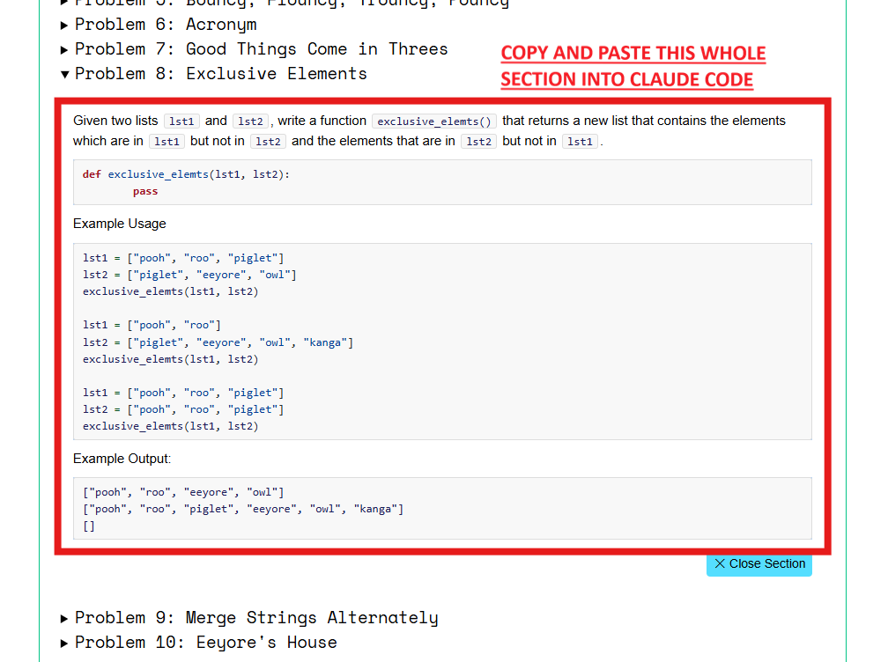

# T.I.P. — Test It, Please

A shared workspace for collaborating during CodePath student breakout sessions, with easy pytest test case generation built in.

## What this is

This repo is a workspace for pairing or grouping up on CodePath problems together, built around one core tool: a Claude Code slash command called `/gen-tests`. Paste in a problem statement and a function signature, and it creates:

- an empty `solution.py` stub for you to implement (it never writes the solution for you)
- a `test_solution.py` file with a handful of pytest edge-case tests

Then you write your solution and run pytest to get instant pass/fail feedback — no need to hand-write test cases before you can start checking your work.

This is meant for **student collaboration breakout sessions**.

## Requirements

Before your session, make sure you have:

- Python 3.10+ (built and tested on 3.12.3)
- [Claude Code](https://claude.com/claude-code) installed and signed in
- VS Code with the [Live Share extension](https://marketplace.visualstudio.com/items?itemName=MS-vsliveshare.vsliveshare)
- Zoom (or similar) for screen sharing

## Setup

```bash
git clone <this-repo-url>
cd test-it-please
python3 -m venv .venv
source .venv/bin/activate
pip install -r requirements.txt
code .
```

Then open Claude Code in the project directory. That's it.

## Usage

A typical breakout session looks like this:

1. Whoever is driving starts a VS Code Live Share session and shares the link with the group.
2. That same person should **also share their screen over Zoom**. This lets everyone watch terminal output — test runs, pass/fail results — live, without needing read/write terminal access in Live Share.
3. Open the assignment on the CodePath hub and find the problem section for the problem you're working on. Select the whole section — problem statement, function signature, example usage, and example output — and copy it. (See the screenshot below for exactly what to select.)
4. In Claude Code, run `/gen-tests`, then paste in that whole copied section.
5. Claude Code creates `problems/<slug>/solution.py` (an empty stub) and `problems/<slug>/test_solution.py` (edge-case tests).
6. As a group, write the implementation in `solution.py`.
7. Run the tests:
   ```bash
   pytest problems/<slug> -v
   ```
8. Not sure what to expect? Check out `problems/p1_sum_digits/` — a small worked example already checked into this repo.



## Example

Paste something like this into `/gen-tests`:

> Given a non-negative integer `n`, return the sum of its digits.
>
> `def sum_digits(n: int) -> int:`

Claude Code creates:

```
problems/p1_sum_digits/
├── __init__.py
├── solution.py        # def sum_digits(n: int) -> int: \n    pass
└── test_solution.py   # 6 pytest cases covering single digits, zero,
                        # repeated digits, trailing zeros, and large numbers
```

Then run:

```bash
pytest problems/p1_sum_digits -v
```

## Contributing

Found an edge case `/gen-tests` misses? Have an idea to make this more useful for breakout sessions? Open an issue or a PR — improvements welcome.
